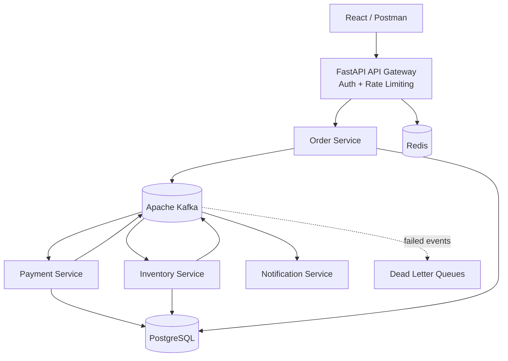

# 🚀 Event-Driven Distributed Order Platform

[](https://github.com/AloneRider-pixel/event-driven-platform/actions/workflows/ci.yml)
[](LICENSE)

**Scalable e-commerce backend demonstrating event-driven microservices with Kafka, FastAPI, PostgreSQL, and Redis.**

> **Portfolio focus:** microservices + event-driven architecture + distributed workflows + reliability + API engineering.

## Architecture



## Order lifecycle

1. Client submits an order through the API gateway.
2. Order Service validates and persists the order, then publishes `OrderCreated`.
3. Payment and Inventory consume the event independently.
4. Services publish success/failure events such as `PaymentCompleted` and `InventoryReserved`.
5. Notification Service consumes domain events and dispatches customer notifications.
6. Failed events can be routed to a dead-letter queue for investigation or replay.

## Engineering capabilities

### Microservices
- API gateway with authentication, rate limiting, routing, and versioned APIs.
- Order, Payment, Inventory, and Notification services with separate responsibilities.
- Shared event and model definitions.

### Distributed systems
- Kafka topics and consumer groups.
- Saga-style compensation for distributed order workflows.
- Idempotency for duplicate event delivery.
- Exponential backoff and retry handling.
- Dead-letter queues for failed events.
- Optimistic inventory locking.

### Reliability
- Service health/readiness endpoints.
- Correlation IDs and structured logs.
- Prometheus-compatible metrics.
- Graceful degradation and independent service scaling.

### Security and performance
- JWT authentication with role-based access.
- Redis-backed rate limiting and caching.
- Database indexing and connection pooling.
- Dockerized services and GitHub Actions CI/CD.

## Technology stack

| Layer | Technology |
|---|---|
| Services | Python 3.11, FastAPI, SQLAlchemy |
| Messaging | Apache Kafka, aiokafka |
| Database | PostgreSQL 16 |
| Cache | Redis 7 |
| Authentication | JWT, bcrypt |
| Testing | Pytest, HTTPX, Locust |
| Infrastructure | Docker, Docker Compose, GitHub Actions |

## Repository structure

```text
event-driven-platform/
├── shared/                      # Shared models, events, Kafka helpers
├── api-gateway/                 # Auth, routing, rate limiting
├── order-service/               # Order API + event producer
├── payment-service/             # Payment consumer + workflow
├── inventory-service/           # Reservation consumer + stock logic
├── notification-service/        # Event-driven notifications
├── scripts/                     # Utilities and load testing
├── .github/workflows/ci.yml
├── docker-compose.yml
└── README.md
```

## Local development

### Prerequisites

- Docker + Docker Compose

### Start

```bash
git clone https://github.com/AloneRider-pixel/event-driven-platform.git
cd event-driven-platform
cp .env.example .env
docker-compose up -d
```

The stack starts Kafka, PostgreSQL, Redis, the API gateway, and the domain services.

### Example request

```bash
curl -X POST http://localhost:8000/api/v1/orders \
  -H "Content-Type: application/json" \
  -d '{"product_id":"PROD-001","quantity":2,"customer_id":"CUST-001"}'
```

## API surface

| Method | Endpoint | Purpose |
|---|---|---|
| POST | `/api/v1/orders` | Create an order |
| GET | `/api/v1/orders/{id}` | Retrieve an order |
| GET | `/api/v1/orders` | Paginated order list |
| PUT | `/api/v1/orders/{id}/cancel` | Cancel an order |
| POST | `/api/v1/orders/{id}/retry` | Retry a failed order |
| GET | `/api/v1/inventory/{product_id}` | Check inventory |
| GET | `/health` | Health check |
| GET | `/metrics` | Service metrics |

## Event contracts

| Topic | Producer | Consumers |
|---|---|---|
| `order.created` | Order Service | Payment, Inventory, Notification |
| `order.cancelled` | Order Service | Payment, Inventory, Notification |
| `payment.completed` | Payment Service | Order, Notification |
| `payment.failed` | Payment Service | Order, Notification |
| `inventory.reserved` | Inventory Service | Order, Notification |
| `inventory.insufficient` | Inventory Service | Order, Notification |
| `*.dlq` | Domain services | Investigation / replay |

## Testing

The project includes service-level tests plus HTTP and load-test tooling. CI should remain green before changes are merged into `main`.

## Roadmap

- Transactional outbox for reliable event publication.
- Schema registry and versioned event contracts.
- Kafka lag and consumer-health dashboards.
- Distributed tracing with OpenTelemetry.
- Kubernetes deployment and autoscaling examples.

## License

MIT
