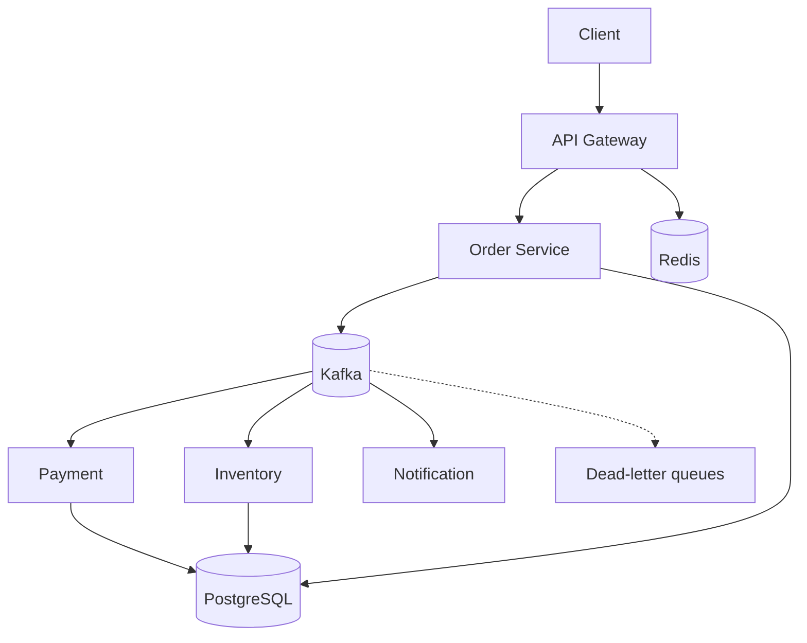

# 🚀 Event-Driven Distributed Order Platform

[](https://github.com/AloneRider-pixel/event-driven-platform/actions/workflows/ci.yml)
[](https://github.com/AloneRider-pixel/event-driven-platform/actions/workflows/codeql.yml)
[](LICENSE)

Scalable order-processing backend demonstrating Kafka-based microservices, distributed workflows, retries, idempotency, and operational controls.

## System flow


```mermaid
graph TB
    CLIENT[Client] --> GW[API Gateway]
    GW --> ORDER[Order Service]
    ORDER --> KAFKA[(Kafka)]
    KAFKA --> PAY[Payment]
    KAFKA --> INV[Inventory]
    KAFKA --> NOTIF[Notification]
    PAY --> PG[(PostgreSQL)]
    INV --> PG
    ORDER --> PG
    GW --> REDIS[(Redis)]
    KAFKA -.-> DLQ[Dead-letter queues]
```

## Engineering capabilities

- API gateway authentication and rate limiting.
- Independent Order, Payment, Inventory, and Notification services.
- Kafka consumer groups and shared event contracts.
- Saga-style compensation, retries, idempotency, and dead-letter handling.
- Health/readiness endpoints, correlation IDs, structured logs, and metrics.
- Dockerized local development and GitHub Actions validation.

## Event contracts

| Topic | Producer | Consumers |
|---|---|---|
| `order.created` | Order | Payment, Inventory, Notification |
| `order.cancelled` | Order | Payment, Inventory, Notification |
| `payment.completed` | Payment | Order, Notification |
| `payment.failed` | Payment | Order, Notification |
| `inventory.reserved` | Inventory | Order, Notification |
| `inventory.insufficient` | Inventory | Order, Notification |
| `*.dlq` | Domain services | Investigation / replay |

## Stack

| Layer | Technology |
|---|---|
| Services | Python 3.11, FastAPI, SQLAlchemy |
| Messaging | Apache Kafka, aiokafka |
| Data | PostgreSQL 16, Redis 7 |
| Auth | JWT, bcrypt |
| Tests | Pytest, HTTPX |
| Delivery | Docker Compose, GitHub Actions |

## Repository layout

```text
shared/                 # Events, models, Kafka helpers
api-gateway/            # Auth, routing, rate limiting
order-service/
payment-service/
inventory-service/
notification-service/
scripts/
docs/
.github/workflows/
```

## Quick start

```bash
git clone https://github.com/AloneRider-pixel/event-driven-platform.git
cd event-driven-platform
cp .env.example .env
docker compose up -d
```

## Verification

Run the shared contract suite and service-specific tests locally:

```bash
pytest shared/tests/ -v
pytest order-service/tests/ -v
pytest inventory-service/tests/ -v
```

CI also validates the service matrix and container builds.

## Reliability boundaries

Event delivery is treated as at-least-once: consumers must remain idempotent, retries must be safe, and dead-letter/replay behavior is part of the operational contract.

## Evidence and reproducibility

Load-test or reliability claims should include workload, environment, duration, tool version, sample size, and producing commit. Synthetic scenarios are validation fixtures, not production measurements.

## Roadmap

- Transactional outbox.
- Versioned schema registry integration.
- Kafka lag and consumer-health dashboards.
- Distributed tracing.
- Kubernetes deployment examples.

## Review path

Start with [architecture](docs/architecture.md), [verification](docs/verification.md), and [evidence policy](docs/evidence-policy.md). Review shared event contracts before changing consumers.

## Maintenance standard

Preserve backward-compatible event contracts, idempotency, retry safety, and observable failure states.

## License

MIT
