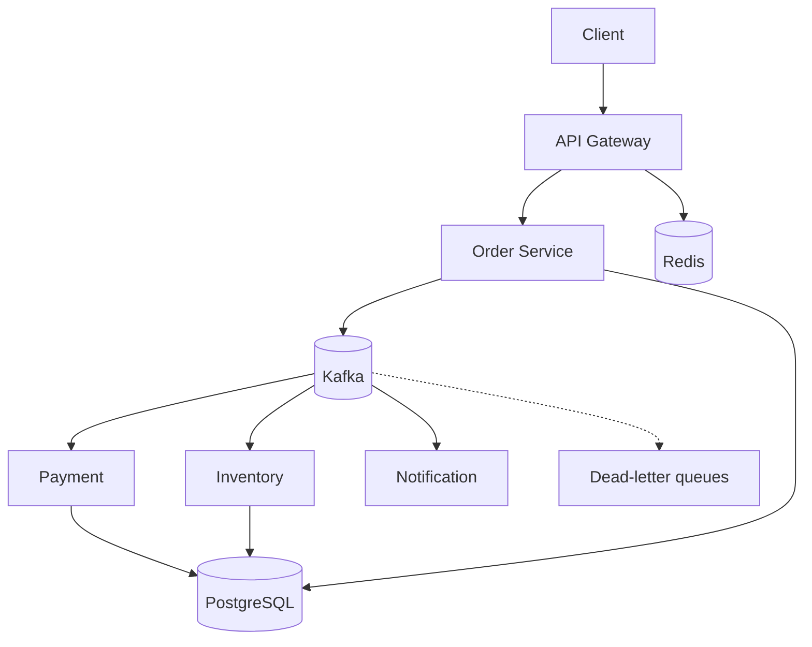

# Event-Driven Distributed Order Platform

[](https://github.com/AloneRider-pixel/event-driven-platform/actions/workflows/ci.yml)
[](https://github.com/AloneRider-pixel/event-driven-platform/actions/workflows/codeql.yml)
[](LICENSE)

Distributed order-processing reference system demonstrating Kafka messaging, microservice boundaries, idempotency, retries, compensation, dead-letter handling, and operational visibility.

## System flow


```mermaid
graph TB
    CLIENT[Client] --> GW[API Gateway]
    GW --> ORDER[Order Service]
    ORDER --> KAFKA[(Kafka)]
    KAFKA --> PAY[Payment]
    KAFKA --> INV[Inventory]
    KAFKA --> NOTIF[Notification]
    PAY --> PG[(PostgreSQL)]
    INV --> PG
    ORDER --> PG
    GW --> REDIS[(Redis)]
    KAFKA -.-> DLQ[Dead-letter queues]
```

## Engineering capabilities

- API gateway authentication and rate limiting.
- Independent order, payment, inventory, and notification services.
- Shared versioned event contracts.
- At-least-once delivery with consumer idempotency.
- Retry and compensation paths for distributed workflows.
- Dead-letter and replay-oriented failure handling.
- Health/readiness checks, correlation IDs, structured logs, and metrics.

## Event contract examples

| Topic | Producer | Consumers |
|---|---|---|
| `order.created` | Order | Payment, Inventory, Notification |
| `order.cancelled` | Order | Payment, Inventory, Notification |
| `payment.completed` | Payment | Order, Notification |
| `payment.failed` | Payment | Order, Notification |
| `inventory.reserved` | Inventory | Order, Notification |
| `inventory.insufficient` | Inventory | Order, Notification |
| `*.dlq` | Services | Investigation / replay |

## Stack

| Layer | Technology |
|---|---|
| Services | Python 3.11, FastAPI, SQLAlchemy |
| Messaging | Apache Kafka, aiokafka |
| Data | PostgreSQL 16, Redis 7 |
| Auth | JWT, bcrypt |
| Tests | Pytest, HTTPX |
| Delivery | Docker Compose, GitHub Actions |

## Repository map

```text
shared/
api-gateway/
order-service/
payment-service/
inventory-service/
notification-service/
scripts/
docs/
.github/workflows/
```

## Quick start

```bash
git clone https://github.com/AloneRider-pixel/event-driven-platform.git
cd event-driven-platform
cp .env.example .env
docker compose up -d
```

## Verification

```bash
pytest shared/tests/ -v
pytest order-service/tests/ -v
pytest inventory-service/tests/ -v
```

CI additionally validates the service matrix, container builds, CodeQL, dependency review, and Scorecard.

## Reliability contract

Assume at-least-once event delivery. Order mutations and their outbound events are committed together through the transactional outbox. A background publisher drains durable outbox rows to Kafka, so a broker outage does not lose an event after the database transaction succeeds. Consumers must remain idempotent because a crash after Kafka publication but before the outbox acknowledgement can legitimately produce a duplicate.

## Security

Keep authentication keys, database credentials, and provider credentials out of source control. Treat event payloads as untrusted input and preserve authorization at service boundaries.

## Evidence policy

Load-test and reliability claims should identify workload, duration, environment, tooling, sample count, and producing commit. Synthetic scenarios are validation fixtures.

## Documentation

- [Architecture](docs/architecture.md)
- [Verification](docs/verification.md)
- [Evidence policy](docs/evidence-policy.md)

## Roadmap

Outbox replay tooling, schema-registry integration, Kafka lag dashboards, distributed tracing, and Kubernetes deployment examples.

## License

MIT
