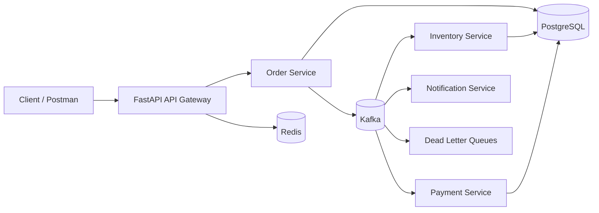

# Event-Driven Platform Architecture

## Core patterns

- Domain services communicate asynchronously through Kafka events.
- Idempotency protects consumers from duplicate delivery.
- Retries use backoff; failed messages can move to dead-letter queues.
- Saga-style coordination handles distributed order/payment/inventory state transitions.
- Correlation IDs and structured logs make cross-service requests traceable.
